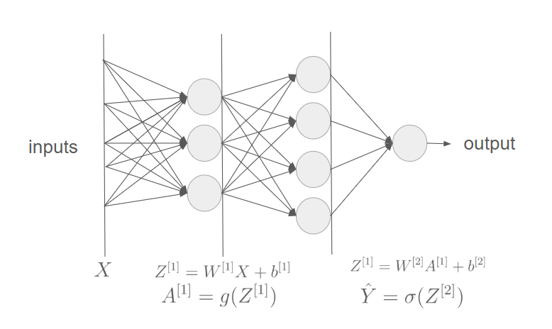
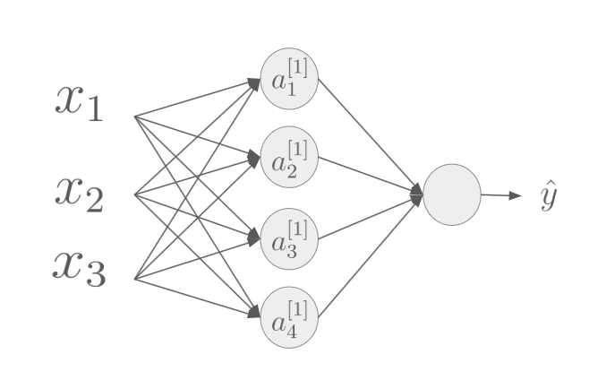

# Backpropagation

## Forward propagation

### Perceptron

Almost all the bibliography on neural networks begins with the same topic: the perceptron. This is indeed the best way to introduce a simple model that helps us understand how a neural network works.

When we talk about perceptrons, we refer to the model developed by Frank Rosenblatt between the 1950s and 1960s. Rosenblatt built upon the earlier work of Warren McCulloch and Walter Pitts, who studied neurons as logical units, and proposed a mathematical way to model them. His perceptron was essentially a linear classifier, where each artificial neuron produced an output based on a weighted sum of inputs and a threshold. Although modern models are far more complex, it is still useful to study this foundation.

**How the perceptrons work?**

The perceptron takes binary inputs $x_1, x_2, \dots, x_n \in \{0,1\}$ (similar to electrical signals in a biological brain) and produces a single binary output.

<image src="./sources/perceptron.png" alt="Perceptron schema.">

Each input is associated with a weight $\omega_1, \omega_2, \dots, \omega_n \in \mathbb{R}$. The perceptron computes the weighted sum $\sum_j \omega_j x_j$ and compares it against a threshold value:

$$
output = \begin{cases}
    0 & \text{if    } \sum_j \omega_j x_j \leq \text{threshold} \\
    1 & \text{if    } \sum_j \omega_j x_j > \text{threshold}
\end{cases}
$$

This is the essence of the model: simple but powerful.

**Example (Michael Nielsen)**

[Michael Nielsen](http://neuralnetworksanddeeplearning.com/chap1.html) illustrates this with a decision-making example. Suppose a newspaper announces a cheese festival in your town. You would be happy to attend if the weather is good, regardless of whether your partner wants to go or whether public transport is convenient.

You can model this decision with a perceptron. Assign a large weight $\omega_1=6$ to the weather (since it matters most to you), and smaller weights $\omega_2=2$ and $\omega_3=3$ to the other conditions. If you choose a threshold of 5, then the perceptron outputs 1 (go to the festival) whenever the weather is good, and 0 otherwise. In this model, the partner’s preference and the transport situation do not affect the final outcome.

**From Single to Multi-layer Perceptrons**

So far we have considered a single-layer perceptron. However, real decision-making is often more complex and requires multiple layers.

<image src="./sources/perceptron_multilayer.png" alt="Perceptron multi-layer schema.">

In the network above, the first layer consists of perceptrons making simple decisions. The second layer takes the outputs of the first and combines them into more abstract features. Finally, the third layer integrates those abstractions into the final output. This hierarchical structure makes the network more expressive than a single perceptron.

**Mathematical Reformulation**

We can rewrite the perceptron condition more compactly. Instead of $\sum_j \omega_j x_j > \text{threshold}$, we define the dot product:

$$\omega \cdot x \equiv\sum_j\omega_j x_j$$
 
where $\omega$ and $x$ are vectors of weights and inputs, respectively. By moving the threshold to the left-hand side, we define a bias term $b \equiv -\text{threshold}$. The rule becomes:

$$
output = \begin{cases}
    0 & \text{if    }  \omega\cdot x + b\leq 0 \\
    1 & \text{if    }  \omega\cdot x + b > 0
\end{cases}
$$

**Geometric Interpretation and Convergence**

From a mathematical perspective, the perceptron is a linear classifier. It partitions the input space with a hyperplane defined by the linear combination $\sum_j \omega_j x_j + b = 0$. A perceptron converges to a stable solution only if the training set can be separated correctly by such a hyperplane.

- If the dataset $D$ is linearly separable, the perceptron algorithm is guaranteed to converge.
- If the dataset is not linearly separable, i.e., positive and negative samples cannot be separated by a hyperplane, then the algorithm will fail to converge.

The complexity of testing linear separability is bounded by

The lineal separability is stable in $$min(O(n^{d/2}), O(d^{2n}), O(n^{d-1}\log n))$$

where $n$ is the number of data points and $d$ is their dimensionality.

This convergence property is known as the Perceptron Convergence Theorem, originally proved by [Rosemblatt](https://www.researchgate.net/publication/36249536_Gendered_Compromises_Political_Cultures_and_the_State_in_Chile_1920-1950)

### Sigmoid neurons

Let us extend the models introduced earlier. A set of inputs $x$ taking values between 0 and 1 produces an output, also constrained between 0 and 1, through a function depending on the weights $\omega$ and a bias $b$.

In the perceptron model, the output depends discretely on the values of the weights and the bias: the output is either 0 or 1. This means that even minimal changes in the parameters may flip the output completely. For example, if each input corresponds to a pixel in an image, a tiny change in a weight or bias could transform a correct classification into an incorrect one. This instability is a direct consequence of the binary nature of the perceptron model.

To address this issue, we introduce sigmoid neurons.

**From Step Function to Sigmoid Function**

So far, our decision-making rule was based on the Heaviside step function, which outputs 0 or 1 depending on the weighted sum of inputs plus the bias. As discussed, this makes the model highly sensitive to small parameter changes.

To smooth this behavior, we replace the step function with the sigmoid function, which produces a continuous output between 0 and 1:

$$\sigma(z)\equiv\frac{1}{1+e^{-z}}$$

**Explicit formulation**

For a neuron with inputs $x_1, x_2, \dots, x_n$, weights $\omega_1, \omega_2, \dots, \omega_n$, and bias $b$, the sigmoid neuron computes:

$$\sigma(x, \omega, b)=\frac{1}{1+e^{-\omega\cdot x-b}}$$

where $\omega \cdot x = \sum_j \omega_j x_j$.

**Key property**

The sigmoid function is a smooth approximation of the Heaviside step. Small variations in the parameters (weights or bias) lead to correspondingly small changes in the output, making the model much more stable and differentiable — a property that is essential for gradient-based learning algorithms.

**Derivative of the Sigmoid Function**

One of the most important properties of the sigmoid function is that it is *differentiable* and its derivative can be expressed in a particularly simple form. This makes it ideal for training neural networks using gradient-based optimization methods such as **backpropagation**.

**Step-by-Step Derivation**

1. Differentiate with respect to $z$:
$$\frac{d\sigma}{dz}=\frac{d}{dz}\left( \frac{1}{1+e^{-z}}\right)$$
2. Apply the quotien rule (or chain rule):
$$\frac{d\sigma}{dz}=\frac{e^{-z}}{(1+e^{-z})^2}$$
3. Multiply numerator and denominator by $e^z$ to simplify:
$$\frac{d\sigma}{dz}=\frac{1}{1+e^{-z}}\cdot\left(1-\frac{1}{1+e^{-z}}\right)$$
4. Recognize the terms as $\sigma(z)$ and $1-\sigma(z)$
$$\frac{d\sigma}{dz}=\sigma(z)(1-\sigma(z))$$

**Interpretation**

This compact rsult shows that the derivative of the sigmoid can be written in terms of the sigmoid itself. This has two fundamental consequences:
- **Efficiency**: We can reuse the computed value of $\sigma(z)$ to obtain tis derivative without additional expensive operations.
- **Stability**: The derivative is always bounded between 0 and 0.25, avoiding extreme gradients.

### Gradient Descent

So far, we have described perceptrons and sigmoid neurons as models where outputs depend on inputs weights, and biases. But how do we find hte right values for these weights and biases so that the network makes correct predictions?

The answer lies in defining a cost function (also called loss function), which measures how far the network's predictions are from the desired outputs.

**Example: Quadratic Cost Function**

Suppose the training dataset consists of pairs $(x,y)$, where $x$ is the input vector and $y$ the expected output. For a network with output $a$, a common choice of cost function is the mean squared error (MSE):

$$C=\frac{1}{2n}\sum^n_{i=1}(a(x_i)-y_i)^2$$

where $n$ is the number of training examples.
- If $a(x_i)$ is close to $y_i$, the cost is small.
- If $a(x_i)$ is far from $y_i$, the cost is large.

Thus training a neural network is equivalent to minimizing $C$ with respect to the parameters (weights $\omega$ and biases $b$).

**Idea of Gradient Descent**

To minimize $C$, we adjust the parameters step by step in the direction that decreases the cost the fastest. this direction is given by the gradient $\nabla C$.

For a single parameter $\theta$ (weight of bias):

$$\theta\leftarrow\omega - \eta\frac{\partial C}{\partial \theta}$$

where $\eta>0$ is the learning rate, controlling the size of each update.
- If $\eta$ is too large $\rightarrow$ we may overshoot the minimum.
- If $\eta$ is too small $\rightarrow$ convergence will be very slow.

**Why Gradient Descent?**
1. It provides a systematic way to adjust weights and biases.
2. It uses calculus (derivatives) to guide the search for better parameters.
3. It connects directly with sigmoid neurons, since their differentiability ensures that $\frac{\partial C}{\partial\theta}$ is well defined.

Gradient descent tells us how to update each parameter, but in a large network there may be millions of weights and biases. Computing all the partial derivatives $\frac{\partial C}{\partial \theta}$ directly would be extremely inefficient.

### Solving the Neural Network

We have already introduced perceptrons and sigmoid neurons, and why smooth, differentiable activations matter. Let us now formalize how information flows through a network **without breaking the narrative**: we start from intuition, then fix notation, then solve the specific two-layer case (one hidden layer), and *only then* connect it to gradient descent.

#### From intuition to notation

A layer takes activations from the previous layer, applies a linear map (weights + bias), and then a nonlinearity. We will denote, for layer $l$, $W^{[l]}$ (weights), $b^{[l]}$ (bias), $Z^{[l]}$ (pre-activation), and $A^{[l]}$ (activation), with $A^{[0]} \equiv X$.

#### The specific network we will solve (one hidden layer)

- **Hidden layer (size $n_h$)**

$$
\begin{aligned}
Z^{[1]} &= W^{[1]}X + b^{[1]},\\
A^{[1]} &= g\!\big(Z^{[1]}\big),
\end{aligned}
$$

where $X\in\mathbb{R}^{n_x\times m}$ has $m$ examples by columns, $W^{[1]}\in\mathbb{R}^{n_h\times n_x}$, and $b^{[1]}\in\mathbb{R}^{n_h\times 1}$ (broadcast across columns).

- **Output layer (binary output)**

$$
\begin{aligned}
Z^{[2]} &= W^{[2]}A^{[1]} + b^{[2]},\\
\hat Y \;=\; A^{[2]} &= \sigma\!\big(Z^{[2]}\big),
\end{aligned}
$$

with $W^{[2]}\in\mathbb{R}^{1\times n_h}$, $b^{[2]}\in\mathbb{R}^{1\times 1}$, and $\hat Y\in\mathbb{R}^{1\times m}$.

This is the **forward propagation** for the concrete case we care about.

#### Why this structure matters (the optimization view)

Forward propagation gives predictions $\hat Y$ from inputs $X$ using current parameters $\{W^{[l]}, b^{[l]}\}$. Training means choosing those parameters so that $\hat Y$ matches the true labels $Y$.

To make this precise, we define a **cost** (loss) that quantifies error. For binary classification, the standard choice with a sigmoid output is **cross-entropy**:
$$
J(W,b)=\frac{1}{m}\sum_{i=1}^{m}\mathcal L\!\big(\hat y^{(i)},y^{(i)}\big),\qquad
\mathcal L(\hat y,y)=-\Big[y\log\hat y+(1-y)\log(1-\hat y)\Big].
$$

Now the goal is clear: **minimize $J$** over all $W^{[1]},b^{[1]},W^{[2]},b^{[2]}$.

#### The bridge to Gradient Descent

Once $J$ is defined, the natural way to reduce it is **gradient descent**: move each parameter a small step in the direction that most decreases the cost.
$$
W^{[l]}\leftarrow W^{[l]}-\eta\,\frac{\partial J}{\partial W^{[l]}},\qquad
b^{[l]}\leftarrow b^{[l]}-\eta\,\frac{\partial J}{\partial b^{[l]}},
$$
with learning rate $\eta>0$.

The crucial point is that the gradients $\frac{\partial J}{\partial W^{[l]}}$ and $\frac{\partial J}{\partial b^{[l]}}$ depend on the **forward quantities**
$(Z^{[l]},A^{[l]})$ we just defined. This is exactly why we fixed the notation: it lets us compute those derivatives systematically. The algorithm that does it efficiently, layer by layer via the chain rule, is **backpropagation** (next section).

> **Shapes checklist (for implementation)**
> $$
> Z^{[l]},A^{[l]}\in\mathbb{R}^{n_l\times m},\quad
> W^{[l]}\in\mathbb{R}^{n_l\times n_{l-1}},\quad
> b^{[l]}\in\mathbb{R}^{n_l\times 1}.
> $$
> Bias vectors are broadcast over the $m$ columns.

## Backward Propagation

So far, we have shown how to train neural networks by adjusting weights and biases with the gradient descent algorithm, but we have not explained how to compute these gradients efficiently. If we try to compute each gradient one by one, or use numerical approximations, the computational cost becomes prohibitive even for moderately sized networks. Moreover, in deep networks, vanishing or exploding gradients may arise, causing some layers to learn more slowly or behave unstably.

In problems with thousands or millions of parameters, we cannot rely on an inefficient approach. Computing the gradient of the cost with respect to each weight directly (i.e., changing one weight at a time and measuring how the loss changes) would require separate evaluations of the network for every parameter. In practice, this is **computationally infeasible**. We need an algorithm that exploits the structure of the network—layers connected by differentiable functions—to compute all gradients essentially in a single pass.

**What is backpropagation?**

Backpropagation is a procedure for training neural networks. It efficiently computes the derivative of the cost with respect to every weight and bias in the network. It is based on the repeated application of the chain rule. The name reflects the workflow: first, we compute the network output through forward propagation; then, starting from the output layer, we work backward layer by layer, accumulating the information needed to obtain the derivatives.

## Mathematical Notation

We will use the forward-propagation notation:
$$
\begin{aligned}
Z^{[1]} &= W^{[1]}X + b^{[1]},\\
A^{[1]} &= g\!\big(Z^{[1]}\big),
\end{aligned}
$$
where $X\in\mathbb{R}^{n_x\times m}$ contains $m$ examples by columns, 
$W^{[1]}\in\mathbb{R}^{n_h\times n_x}$, and $b^{[1]}\in\mathbb{R}^{n_h\times 1}$ (broadcast across columns).

Now, to see what happens **neuron by neuron**, we temporarily switch to a **single example** $x\in\mathbb{R}^{n_x}$ (i.e., one column of $X$).

We index each neuron using a superscript in brackets for the **layer** and a subscript for the **neuron** within that layer. For the figure, the hidden layer computations read:
$$
\begin{aligned}
z^{[1]}_1 &= {w^{[1]}_1}^{\!\top} x + b^{[1]}_1, &\quad a^{[1]}_1 &= \sigma\!\big(z^{[1]}_1\big),\\
z^{[1]}_2 &= {w^{[1]}_2}^{\!\top} x + b^{[1]}_2, &\quad a^{[1]}_2 &= \sigma\!\big(z^{[1]}_2\big),\\
z^{[1]}_3 &= {w^{[1]}_3}^{\!\top} x + b^{[1]}_3, &\quad a^{[1]}_3 &= \sigma\!\big(z^{[1]}_3\big),\\
z^{[1]}_4 &= {w^{[1]}_4}^{\!\top} x + b^{[1]}_4, &\quad a^{[1]}_4 &= \sigma\!\big(z^{[1]}_4\big).
\end{aligned}
$$

Equivalently, in vector/matrix form:
$$ Z^{[1]} =\left[ \begin{aligned} w^{[1]T}_1 \\ w^{[1]T}_2 \\ w^{[1]T}_3 \\ w^{[1]T}_4 \end{aligned} \right] \cdot \left[ \begin{aligned} x_1 \\ x_2 \\ x_3 \end{aligned} \right] + \left[ \begin{aligned} b^{[1]}_1 \\ b^{[1]}_2 \\ b^{[1]}_3 \\ b^{[1]}_4 \end{aligned} \right] = \left[ \begin{aligned} w^{[1]T}_1x + b^{[1]}_1 \\ w^{[1]T}_2x + b^{[1]}_2 \\ w^{[1]T}_3x + b^{[1]}_3 \\ w^{[1]T}_4x + b^{[1]}_4 \end{aligned} \right] = \left[ \begin{aligned} z^{[1]}_1 \\ z^{[1]}_2 \\ z^{[1]}_3 \\ z^{[1]}_4 \end{aligned} \right] $$

Now we need to express the **cost function** using the neuron-wise and vectorized notation above. We start with a **single example** $ (x,y) $ and then extend to a dataset.

### Cost (single example → dataset)

With the forward relations already defined,
$$
z^{[1]} = W^{[1]}x + b^{[1]},\quad a^{[1]} = g^{[1]}(z^{[1]}),\quad
z^{[2]} = W^{[2]}a^{[1]} + b^{[2]},\quad a^{[2]} \equiv \hat y,
$$
the per-example loss is
$$
\mathcal{L}(\hat y, y) = \tfrac{1}{2}\,\|\hat y - y\|_2^2.
$$

For a dataset $\{(x^{(i)},y^{(i)})\}_{i=1}^m$, the empirical cost is
$$
C(W,b) = \frac{1}{2m}\sum_{i=1}^{m}\big\|\,a^{[2](i)} - y^{(i)}\,\big\|_2^2,
\quad
a^{[2](i)} = g^{[2]}\!\big(W^{[2]} g^{[1]}(W^{[1]}x^{(i)} + b^{[1]}) + b^{[2]}\big).
$$

> **Shapes (single example)**: $x\in\mathbb{R}^{n_x}$, $a^{[1]}\in\mathbb{R}^{n_h}$, $\hat y=a^{[2]}\in\mathbb{R}^{n_y}$;
> $W^{[1]}\in\mathbb{R}^{n_h\times n_x}$, $b^{[1]}\in\mathbb{R}^{n_h}$;
> $W^{[2]}\in\mathbb{R}^{n_y\times n_h}$, $b^{[2]}\in\mathbb{R}^{n_y}$.

---

### Gradients via the Chain Rule (same flow and notation)

**Idea.** We now ask a practical question: if we nudge a weight or a bias, how does the cost change?  
We answer it using the forward quantities $(Z^{[l]},A^{[l]})$ and the quadratic loss, keeping the storyline clear:
output first (where the error appears), then the hidden layer, and finally the vectorized mini-batch case.

#### Single example $(x,y)$

Forward map (one hidden layer):
$$
z^{[1]} = W^{[1]}x + b^{[1]},\quad a^{[1]} = g^{[1]}(z^{[1]}),\quad
z^{[2]} = W^{[2]}a^{[1]} + b^{[2]},\quad a^{[2]} = g^{[2]}(z^{[2]}),
$$
with loss $\mathcal L(a^{[2]},y)=\tfrac{1}{2}\|a^{[2]}-y\|_2^2$.

**Step 1 — Output layer (where the mismatch lives).**
$$
\frac{\partial \mathcal L}{\partial a^{[2]}} = a^{[2]} - y,\qquad
\delta^{[2]} \;\equiv\; \frac{\partial \mathcal L}{\partial z^{[2]}}
= (a^{[2]} - y)\odot {g^{[2]}}'(z^{[2]}).
$$
$$
\boxed{\;\frac{\partial \mathcal L}{\partial W^{[2]}} = \delta^{[2]} (a^{[1]})^\top,\qquad
\frac{\partial \mathcal L}{\partial b^{[2]}} = \delta^{[2]}\;}
$$

**Step 2 — Hidden layer (how the error flows back).**
$$
\frac{\partial \mathcal L}{\partial a^{[1]}} = (W^{[2]})^\top \delta^{[2]},\qquad
\delta^{[1]} \;\equiv\; \frac{\partial \mathcal L}{\partial z^{[1]}}
= \big((W^{[2]})^\top \delta^{[2]}\big)\odot {g^{[1]}}'(z^{[1]}).
$$
$$
\boxed{\;\frac{\partial \mathcal L}{\partial W^{[1]}} = \delta^{[1]} x^\top,\qquad
\frac{\partial \mathcal L}{\partial b^{[1]}} = \delta^{[1]}\;}
$$

> **Shapes (single example)**:
> $\delta^{[2]}\in\mathbb{R}^{n_y}$, $\delta^{[1]}\in\mathbb{R}^{n_h}$;
> $\partial \mathcal L/\partial W^{[2]}\in\mathbb{R}^{n_y\times n_h}$, $\partial \mathcal L/\partial b^{[2]}\in\mathbb{R}^{n_y}$;
> $\partial \mathcal L/\partial W^{[1]}\in\mathbb{R}^{n_h\times n_x}$, $\partial \mathcal L/\partial b^{[1]}\in\mathbb{R}^{n_h}$.

---

#### Dataset of $m$ examples (vectorized mini-batch)

Forward (stack columns):
$$
A^{[0]}=X,\;\; Z^{[1]}=W^{[1]}X+b^{[1]},\;\; A^{[1]}=g^{[1]}(Z^{[1]}),\;\;
Z^{[2]}=W^{[2]}A^{[1]}+b^{[2]},\;\; A^{[2]}=g^{[2]}(Z^{[2]}),
$$
$$
C=\frac{1}{2m}\sum_{i=1}^m \|A^{[2]}_{\cdot i}-Y_{\cdot i}\|_2^2.
$$

Backward (average at the end):
$$
\delta^{[2]}=(A^{[2]}-Y)\odot {g^{[2]}}'(Z^{[2]}),\qquad
\delta^{[1]}=(W^{[2]})^\top \delta^{[2]}\odot {g^{[1]}}'(Z^{[1]}),
$$
$$
\boxed{\;dW^{[2]}=\frac{1}{m}\,\delta^{[2]}(A^{[1]})^\top,\qquad
db^{[2]}=\frac{1}{m}\sum_{j=1}^m \delta^{[2]}_{\cdot j}\;}
$$
$$
\boxed{\;dW^{[1]}=\frac{1}{m}\,\delta^{[1]}X^\top,\qquad
db^{[1]}=\frac{1}{m}\sum_{j=1}^m \delta^{[1]}_{\cdot j}\;}
$$

We did not introduce anything new—only organized the chain rule along the network’s shape.

## Regularization

At a high level, **regularization** is any mechanism that reduces the effective complexity of a model to improve generalization. In deep learning, it can be understood through five complementary lenses:

- **Optimization problem**: constraints on parameters can be turned into penalties in the loss.
- **Bayesian interpretation (MAP)**: penalties correspond to priors over parameters.
- **Capacity and stability (SRM/PAC-Bayes)**: limiting parameter norms reduces effective hypothesis space and generalization gap.
- **Functional view**: regularization can act directly on the function (e.g., noise injection, Jacobian penalties, label smoothing, augmentations).
- **Algorithmic lens**: the training algorithm itself regularizes (early stopping, SGD implicit bias, weight decay).

### Why Regularize? (What it solves)

The objective is to minimize the **population** risk
$$
\mathcal{L}(\theta)=\mathbb{E}_{(x,y)\sim\mathcal{P}}\,\ell\!\big(f_\theta(x),y\big),
$$
which is unobservable. We train by minimizing the **empirical** risk
$$
\hat{\mathcal{L}}(\theta)=\frac{1}{n}\sum_{i=1}^n \ell\!\big(f_\theta(x_i),y_i\big),
$$
which is susceptible to:
1. **Overfitting** (generalization gap between $\mathcal{L}$ and $\hat{\mathcal{L}}$).
2. **Poor numerical conditioning** (narrow valleys; ill-conditioned Hessians).
3. **Lack of robustness** (high sensitivity to disturbances/adversaries).
4. **Ambiguity in solutions** (ill-posedness/flat directions in overparameterized DL).

Regularization introduces a **controlled inductive bias** that  
i) reduces effective capacity,  
ii) improves conditioning,  
iii) stabilizes training, and  
iv) guides solutions toward desirable properties (smoothness, margin, sparsity, Lipschitz, etc.).

### General Formulation

Given a complexity functional $\Omega(\theta)$,
$$
\min_\theta\ \hat{\mathcal{L}}(\theta)\quad \text{s.t.} \quad \Omega(\theta)\le \tau
\quad \Longleftrightarrow \quad
\min_\theta\ \hat{\mathcal{L}}(\theta)+\lambda\,\Omega(\theta),
$$
with equivalence (KKT) under Slater’s condition. The key is to choose $\Omega$ according to the desired inductive bias.

> **Convention in networks**: penalize **weights** $W^{[l]}$, not biases $b^{[l]}$ nor normalization parameters $(\gamma,\beta)$.

#### The five lenses that justify regularization

1. **Optimization (constraint $\leftrightarrow$ penalty)**  
   Penalization is the solvable form of constraints. In networks:
   $$
   J(\theta)=\hat{\mathcal{L}}(\theta)+\frac{\lambda}{2}\sum_{l=1}^L \|W^{[l]}\|_F^2 \quad \text{(L2 case)}
   $$

2. **Bayes (MAP)**  
   With likelihood $p(y\mid x,\theta)$ and prior $p(\theta)\propto e^{-\lambda\Omega(\theta)}$,
   $$
   \theta_{\text{MAP}}=\arg\min_\theta\left[-\sum_{i=1}^n \log p\big(y_i\mid x_i,\theta\big)+\lambda\,\Omega(\theta)\right].
   $$
   - Isotropic Gaussian prior $\Rightarrow \Omega=\tfrac{1}{2}\|\theta\|_2^2$ (L2).  
   - Laplace prior $\Rightarrow \Omega=\|\theta\|_1$ (L1).

3. **Capacity/Stability (SRM, PAC-Bayes)**  
   Narrowing $\Omega$ reduces complexity and the generalization gap. For feedforward nets with 1-Lipschitz activations:
   $$
   \|f_\theta(x)-f_\theta(x')\|\ \le\ \Big(\prod_{l=1}^L \|W^{[l]}\|_2\Big)\,\|x-x'\|.
   $$
   Controlling $\|W^{[l]}\|_2$ (spectral norm) controls the Lipschitz constant; L2 on $\|W^{[l]}\|_F$ acts as a lower-cost surrogate.

4. **Functional (regularize $f$, not only $\theta$)**  
   - **Jacobian penalty**: $\lambda\|\nabla_x f_\theta(x)\|_F^2$.  
   - **Noise injection**: Gaussian noise $\Rightarrow$ Tikhonov (first-order equivalence).  
   - **Augmentations / Label smoothing**: functional regularization with strong inductive bias.

5. **Algorithmic (implicit regularization)**  
   - **Early stopping** $\approx$ L2 with $\lambda(t)$ (Landweber, quadratic problems).  
   - **SGD** favors **flat minima**; in separable logistic regression, GD/SGD $\to$ maximum margin.  
   - **Decoupled weight decay** (AdamW) avoids unwanted interactions with adaptivity.

### Regularization Selection

We start from the standard learning problem: estimate parameters $\theta$ that minimize the population risk $\mathcal{L}(\theta)=\mathbb{E}_{(x,y)\sim \mathcal{P}}\,\ell\!\big(f_\theta(x),y\big)$. Because $\mathcal{L}$ is unobservable, we optimize the empirical risk $\hat{\mathcal{L}}(\theta)=\frac{1}{n}\sum_{i=1}^n \ell\!\big(f_\theta(x_i),y_i\big)$ while controlling effective capacity through $\Omega(\theta)\le \tau$. Under standard regularity (Slater), this is equivalent to the penalized form
$$
\min_\theta\ \hat{\mathcal{L}}(\theta)+\lambda\,\Omega(\theta).
$$
The core design choice is **which $\Omega$** to use, aligned with (i) the noise mechanism and prior uncertainty, (ii) the model’s geometry and numerical conditioning, and (iii) the training dynamics (implicit biases). **L2** emerges as a consequence **only if** these dimensions point to it.

**Bayesian reading.** Assume $y_i=f_\theta(x_i)+\varepsilon_i$ with Gaussian, homoscedastic noise $\varepsilon_i\sim\mathcal{N}(0,\sigma^2 I)$. If prior uncertainty over weights is isotropic, a Gaussian prior $p(\theta)\propto \exp\!\big(-\tfrac{1}{2\tau^2}\|\theta\|_2^2\big)$ yields
$$
\theta_{\text{MAP}}
=\arg\min_\theta\left\{
\underbrace{\tfrac{1}{2\sigma^2}\sum_{i=1}^n \|y_i-f_\theta(x_i)\|_2^2}_{-\log\text{-likelihood}}
+ 
\underbrace{\tfrac{1}{2\tau^2}\|\theta\|_2^2}_{-\log\text{-prior}}
\right\},
$$
i.e., **L2** with $\lambda=\sigma^2/\tau^2$.

**Numerical stabilization (Tikhonov/LM).** Independently of the Bayesian view, deep nets are highly non-linear and often ill-conditioned. Linearizing around $\theta$,
$$
f_{\theta+\Delta}\approx f_\theta+J_\theta \Delta,
$$
with $J_\theta$ the Jacobian of outputs w.r.t. parameters, the local quadratic subproblem (squared loss) is
$$
\min_{\Delta}\ \tfrac{1}{2}\|r-J_\theta\Delta\|_2^2+\tfrac{\lambda}{2}\|\Delta\|_2^2,\qquad r:=y-f_\theta(x).
$$
The regularized normal equations $(J_\theta^\top J_\theta+\lambda I)\Delta=J_\theta^\top r$ show the **Tikhonov** role of L2: adding $\lambda I$ lifts small eigenvalues, improving conditioning and damping ill-determined directions.

**Stability and Lipschitz control.** For feedforward nets with 1-Lipschitz activations,
$$
\|f_\theta(x)-f_\theta(x')\|\ \le\ \Big(\prod_{l=1}^L \|W^{[l]}\|_2\Big)\,\|x-x'\|.
$$
Bounding spectral norms gives faithful sensitivity control. Penalizing $\sum_l\|W^{[l]}\|_F^2$ (**L2**) typically reduces spectral norms **on average** at lower cost, acting as an efficient surrogate. When strict Lipschitz bounds or adversarial robustness are primary, prefer spectral normalization or Jacobian penalties; L2 is then complementary.

**Implicit bias of the algorithm.** Training procedures are not neutral. In separable classification with cross-entropy, gradient descent converges to **maximum $\ell_2$-margin** solutions; in deep linear models, GD favors low **path-norm** trajectories. In quadratic problems, **early stopping** approximates L2 with time-dependent $\lambda(t)$. Thus, explicit L2 aligns with GD/SGD’s implicit bias, improving stability and promoting **flatter minima**.

**Operational form in neural nets.** Penalize **weights** $W^{[l]}$ (not biases $b^{[l]}$ nor normalization parameters). The training objective becomes
$$
J(\theta)=\hat{\mathcal{L}}(\theta)+\frac{\lambda}{2}\sum_{l=1}^L \|W^{[l]}\|_F^2,
$$
with gradients
$$
\nabla_{W^{[l]}}J=\nabla_{W^{[l]}}\hat{\mathcal{L}}+\lambda W^{[l]}.
$$
A single SGD step with step size $\eta$ yields
$$
W^{[l]}_{t+1}=(1-\eta\lambda)\,W^{[l]}_t-\eta\,\nabla_{W^{[l]}}\hat{\mathcal{L}}(\theta_t),
$$
showing the **multiplicative shrinkage** of weight decay. With adaptive optimizers, prefer **decoupled weight decay (AdamW)** to preserve the learning-rate scale.

**Decision criterion and counterfactuals.** The argument above does **not** assume L2; it **derives** L2 when (i) prior uncertainty is isotropic, (ii) noise is approximately Gaussian/homoscedastic, (iii) numerical stabilization is needed without enforcing sparsity or strict Lipschitz bounds, and (iv) GD/SGD-like methods are used. If the main objective is **sparsity/compression**, use $\ell_1$; if **robustness/Lipschitz** is the priority, use spectral norms or Jacobian penalties. In architectures with group structure, group norms ($\ell_{2,1}$) or orthogonality constraints exploit structure better than isotropic L2. Penalizing biases or normalization parameters often harms calibration; avoid it.

### When **L2** is **not** the right tool

> | Primary objective | Preferred regularizer(s) | Rationale |
> |---|---|---|
> | Sparsity / compression / feature selection | $\ell_1$, Group Lasso, variational dropout | Produces exact zeros (soft-thresholding), enabling compression, latency reduction, partial interpretability. |
> | Lipschitz control / adversarial robustness | Per-layer spectral norm; Jacobian penalty $\|\nabla_x f\|_2^2$ | Direct sensitivity/Lipschitz control; higher cost but more faithful than L2. |
> | Structured parameters (groups/channels/heads) | Group norms (e.g., $\ell_{2,1}$), orthogonality constraints | Respects architectural groups; promotes group-wise sparsity or near-orthogonal features. |
> | Calibration under distribution shift / cost-sensitive deployment | Mixup, label smoothing, Jacobian regularization | Reduces overconfidence; improves calibration and mild-shift robustness. |
> | Batch/LayerNorm scales and biases | **Do not** penalize $\gamma,\beta$ (norm params) or biases $b$ | Avoids shifting means/variances and degrading calibration; target $W$ only. |

### Dropout

During training, **fragile co-adaptations** may arise: some neurons rely on spurious patterns from preceding units. **Dropout** injects multiplicative Bernoulli noise that randomly “turns off” neurons during training. This forces each unit to be useful on its own under many subnetwork configurations. The noise:
- Breaks co-adaptations,
- Acts as implicit ensembling over multiple subnetworks,
- In linear/generalized models, is approximately equivalent to an **adaptive** L2-type penalty per feature.

The practical effect is **better generalization** at minimal computational cost.

#### Layer-level definition

Given pre-activation and activation
$$
a = W x + b,\qquad h = \phi(a),
$$
with $x \in \mathbb{R}^{d_{\text{in}}}$, $W \in \mathbb{R}^{d_{\text{out}}\times d_{\text{in}}}$, $b \in \mathbb{R}^{d_{\text{out}}}$, and nonlinearity $\phi$ (e.g., ReLU),

define a **dropout mask** $m \in \{0,1\}^{d_{\text{out}}}$ with i.i.d. components
$$
m_i \sim \text{Bernoulli}(q),\qquad q = 1 - p,
$$
where $p$ is the **drop probability**.

The most common operative form (**inverted dropout**) scales activations at training time by $1/q$:
$$
\tilde{h} = \frac{m \odot h}{q}.
$$

Under this scheme,
$$
\mathbb{E}\!\left[\tilde{h}\mid h\right] = h,\qquad
\mathrm{Var}\!\left(\tilde{h}_i\mid h_i\right) = \frac{p}{q}\,h_i^2,
$$
so the expected activation is unchanged while the variance increases in a controlled way.

#### L2 relationship (small-noise/linear regime)

In linear models and GLMs, dropout is approximately equivalent to ridge-like penalization with **feature-dependent** weights:
$$
\hat{\mathcal{L}}_{\text{drop}}(\theta)
\;\approx\;
\hat{\mathcal{L}}(\theta)
\;+\;
\frac{p}{2q}\sum_j \Big(\mathbb{E}[x_j^2]\Big)\,\theta_j^2,
$$
highlighting its kinship to L2 and explaining its regularizing power (stronger penalization on connections to high-variance features).

#### Numerical example

Hidden layer with four post-nonlinearity activations:
$$
h = [\,2.0,\; 1.0,\; -1.0,\; 0.5\,].
$$

Take $p = 0.5$ ($q=0.5$) and inverted dropout.
- **Sample 1**: $m = [1,0,1,0] \Rightarrow \tilde{h} = \frac{m\odot h}{q} = [4.0,\,0.0,\,-2.0,\,0.0]$.
- **Sample 2**: $m = [0,1,1,0] \Rightarrow \tilde{h} = [0.0,\,2.0,\,-2.0,\,0.0]$.
- **Sample 3**: $m = [1,1,0,1] \Rightarrow \tilde{h} = [4.0,\,2.0,\,0.0,\,1.0]$.

The expectation of $\tilde{h}$ over $m$ is $h$; the component-wise variance is $(p/q)h_i^2 = 1\cdot h_i^2$.

**Next-layer propagation.**  
Let $v = [1,1,1,1]$ be output weights and $u = v^\top \tilde{h}$ the scalar output. Then
$$
\mathbb{E}[u\mid h] = \sum_i h_i = 2.5,
$$
and, by mask independence,
$$
\mathrm{Var}[u\mid h] = \sum_i v_i^2 \frac{p}{q} h_i^2
= \frac{p}{q}\sum_i h_i^2
= 4 + 1 + 1 + 0.25
= 6.25.
$$

Thus the standard deviation of $u$ induced by dropout is $2.5$. At test time (no masking), $u_{\text{test}} = v^\top h = 2.5$ (the mean).

#### Advantages and disadvantages

**Advantages**
- Breaks co-adaptations and reduces overfitting without architectural changes.
- Implements an implicit ensemble of subnetworks with moderate training cost and zero inference cost (inverted scaling).
- Approximates **adaptive L2** tied to input variance (data-informed regularization).
- Enables simple predictive uncertainty via **MC Dropout**.

**Disadvantages / limitations**
- Slows convergence (gradient noise); may require more epochs or adjusted learning rates.
- Non-trivial interactions with **Batch Normalization**: both are stochastic; careless combination can degrade the signal or complicate MC Dropout.
- In CNNs, per-element dropout can be less effective than **spatial** variants (SpatialDropout, DropBlock).
- In RNNs, independent per-timestep masks can harm dynamics; **variational/locked dropout** (same mask per sequence) or **Zoneout** are preferable.
- In modern pipelines with strong augmentation, calibrated weight decay, and normalization, the marginal benefit may be small or negative if $p$ is high.

#### When dropout is the right tool

> | Primary objective | Preferred regularizer(s) | Rationale |
> |---|---|---|
> | Break co-adaptations and reduce overfitting in MLP/tabular | Dropout with $p\in[0.1,0.5]$ on hidden layers | Bernoulli multiplicative noise reduces fragile dependencies; implicit ensembling of subnetworks. |
> | Regularize the **head** of CNN/Transformer | Dropout on final fully connected layers | Largest capacity often resides in dense heads; improves generalization without disturbing conv/attention blocks. |
> | **Spatial** regularization in CNNs | SpatialDropout / DropBlock | Preserves channel/region coherence; avoids per-element noise that ignores spatial structure. |
> | Fast **uncertainty** estimation | MC Dropout (keep masks at test time, average $T$ passes) | Variational Bayesian view; predictive variance without retraining. |
> | **Small/medium** datasets with high-capacity models | Dropout + moderate weight decay + early stopping | Adds robustness against overfitting when data is limited. |
> | RNNs with **sequence-locked** masks | Variational/Locked Dropout | Same mask across timesteps preserves temporal dynamics. |
> | Adaptive regularization tied to input variance | Dropout (approx. adaptive L2) | Approximately $$\hat{\mathcal{L}}_{\text{drop}}\approx \hat{\mathcal{L}}+\frac{p}{2(1-p)}\sum_j \mathbb{E}[x_j^2]\theta_j^2,$$ penalizing connections to high-variance features. |

#### When dropout is not the right tool (or should be used cautiously)

> | Primary objective | Preferred regularizer(s) | Rationale |
> |---|---|---|
> | Architectures with **heavy BatchNorm** and strong data augmentation | Weight decay (AdamW), Mixup/CutMix, early stopping | BN stochasticity + dropout can interact poorly; with strong augmentation, dropout’s marginal gain often shrinks. |
> | Deep CNNs where spatial coherence is key | DropBlock, Stochastic Depth (DropPath) | Per-element dropout ignores structure; block/channel-level methods work better. |
> | RNNs with **independent per-timestep** masks | Variational/Locked Dropout, Zoneout | Changing masks each step disrupts dynamics and memory; locked masks or Zoneout are safer. |
> | Models already **capacity-limited** (strong bottlenecks) | Light weight decay, more data/augmentation | Dropout may underfit by removing effective capacity. |
> | Fine-grained **calibration** in classification | Label smoothing, Mixup, Jacobian penalty $\|\nabla_x f\|_2^2$ | Dropout does not guarantee better calibration; targeted methods reduce overconfidence more directly. |
> | Large Transformers trained with **massive data** | Weight decay + DropPath | In data-rich regimes, dropout’s effect is small or negative; depth-wise stochasticity is more stable. |
> | Tight latency budgets disallowing **ensembles** | Deterministic inference (no MC), post-hoc uncertainty methods | MC Dropout needs multiple forward passes; avoid if latency is constrained. |
> | Layers with **normalization parameters** and **biases** | Do **not** apply dropout to $\gamma,\beta$ or $b$ | Avoid perturbing scale/shift parameters; focus on intermediate activations. |

### Gradient Descent

At a high level, gradient descent is the fundamental optimization mechanism underlying most neural network training. It iteratively adjusts parameters to minimize a differentiable loss function by following the negative gradient direction. However, in modern deep learning, how we estimate this gradient critically affects not only efficiency, but also generalization, numerical stability, and implicit regularization.

Gradient descent can be understood through five complementary lenses:

- **Optimization**: the update rule defines which subproblem is solved at each step and how costly it is to evaluate.
- **Bayesian interpretation (MAP with stochasticity)**: gradient noise implicitly regularizes by injecting uncertainty around the posterior mode.
- **Capacity and stability**: noise in gradient estimation acts as an implicit regularizer, controlling the “flatness” of the minima found.
- **Functional view**: noisy gradients can be interpreted as injecting noise in the function space, shaping the effective objective landscape.
- **Algorithmic lens**: the training procedure itself regularizes (early stopping, SGD bias toward flat minima, learning-rate schedules).

#### General Objective
Given a dataset $\mathcal{D}={(x_i, y_i)}{i=1}^m$ and a model $f\theta$, we aim to minimize the empirical risk

$$K(\theta)=\frac{1}{m}\sum^m_{i=1}\ell(f_\theta(x_i),y_i),$$
where $\ell$ is a differentiable per-sample loss (e.g., MSE, cross-entropy).

The classical gradient descent update is
$$\theta_{t+1}=\theta_t+\eta_t\nabla_\theta J(\theta_t),$$
with learning rate $\eta_t > 0$.
The key practical question: how do we compute $\nabla_\theta J(\theta_t)$ efficiently?

#### The Three regimes of Gradiente Descent

1- **Full-Batch Gradient Descent**
Uses the **entire dataset** at every iteration, computing the exact gradient of the empirical loss:
$$g_{FB}(\theta)=\nabla_\theta J(\theta)=\frac{1}{m}\sum_{i=1}^m\nabla_\theta\ell(f_\theta(x_i),y_i), \quad \theta_{t+1}=\theta_t-\eta_tg_{FB}(\theta_t)$$

2- **Stochastic Gradient Descent (SGD)**
Uses **a single sample** to estimate the gradient:
$$g_{SGD}(\theta)=\nabla_\theta\ell(f_\theta(x_{i_t}), y_i), \quad i_t\sim\text{Uniform}\{1,\dots,m\}, \quad \theta_{t+1}=\theta_t-\eta_tg_{SGD}(\theta_t)$$

3- **Mini-Batch Gradient Descent (MBGD)**
Uses a subset of the dataset—a mini-batch—of size $B \ll m$:
$$g_{MB}(\theta)=\frac{1}{B}\sum_{i\in B_t}\nabla_\theta\ell(f_\theta(x_i),y_i), \quad \theta_{t+1}=\theta_t-\eta_tg_{MB}(\theta_t)$$
where $B_t$ is a random subset of indices (reshuffled each epoch).

Intuition:

- Averages multiple stochastic gradients → unbiased estimator with variance $\propto 1/B$.
- Strikes a balance between stability (large batches) and noise-driven exploration (small batches).
- Enables efficient parallelization on GPUs/TPUs.

In expectation,
$$\mathbb{E}[g_{MB}(\theta)]=\nabla_\theta J(\theta), \quad Var[g_{MB}(\theta)]\approx\frac{1}{B}\Sigma,$$
so increasing $B$ reduces gradient noise, but may reduce beneficial stochastic regularization.

#### Practical Comparison
> | Criterion                         | Full-Batch                       | Mini-Batch (e.g., (B=32!\sim!1024))     | Stochastic (B=1)                        |
> | --------------------------------- | -------------------------------- | --------------------------------------- | --------------------------------------- |
> | **Gradient accuracy**             | Exact (empirical loss)           | Unbiased; variance $\sim 1/B$           | Unbiased; highest variance              |
> | **Computational cost per update** | High (processes all $m$ samples) | Moderate (processes $B$ samples)        | Minimal                                 |
> | **Updates per epoch**             | 1                                | $\lceil m/B \rceil$                     | $m$                                     |
> | **Convergence stability**         | Very stable (smooth path)        | **High** (noise useful for exploration) | Low (erratic)                           |
> | **GPU utilization**               | Poor for large $m$               | **Optimal** (vectorized batches)        | Inefficient                             |
> | **Generalization behavior**       | May converge to sharp minima     | **Balanced flatness and speed**         | Potentially better minima, but unstable |

#### Why Mini-Batch Gradient Descent is the Standard
1- **Efficiency and parallelism**: matrix operations over batches fully utilize GPUs and TPUs.
2- **Controlled noise**: moderate stochasticity serves as implicit regularization, preventing overfitting and aiding exploration.
3- **Scalability**: compatible with distributed training (data-parallelism), gradient accumulation, and dynamic learning-rate scaling.
4- **Numerical stability**: smoother loss trajectories than pure SGD, faster convergence than full-batch.

## Final notes
- **Sigmoid function as activation function**: Sigmoid function has the property to be a smoothed version of step function. This is more efficient because its derivative could be expressed in terms of itself and this function is more stable because its derivative is always bounded between 0 and 0.25, avoiding extreme gradients.
- **Gradient Descent**: Gradiend Descent is an optimization method used to find the parameter values that minimize the cost function. It's based on iterate over cost function gradient to find de optimum set of parameters. To iterate this method use the learning rate, this is the factor that drive the velocity of convergence. It's necesary to keep the learning rate value, because for too large values we may overshoot the minimum and for values too small the convergence could be very slow.
- **Forward Propagation**: It's a method to solve a neural network taking the natural direcction of the information. Solving the equations of each neuron layer and using this values in the next neuron layer. The fundament behind this method is solve $Z^{[i]}=W^{[i]}\cdot A^{[i-1]}+b^{[i]}$ and use them in the activation function for each layer $A^{[i]}=g(Z^{[i]})$ .
- **Backward Propagation**: Backward propagation is a method to solve a neural network minimizing the cost function for the neural network. Works expressing the cost final layer cost function in function of the previous cost functions layers using the chain rule. $a^{[M]}=g^{[M]}(W^{[M]}\cdot g^{[M-1]}(W^{[M-1]}\cdot g^{[M-2]}(\dots)))$ with the cost function $C(W,b)=\frac{1}{2m}\sum_{i=1}^M\|a^{[M](i)}-y^{(i)}\|^2_2$ 
- **Regularization**: It's a mechanism to reduce the complexity of the model. Consist on apply constrains to cost function. I.e., Penalizing high weights. Usually is used the L2 regularization that use the L2 metric to minimize the distance using the weigths.
- **Dropout**: It's a method to reduce the noise produced in calibration. Consist on drop a random set neurons per layer, which makes a noise reduction. The distribution used to choose which neurons will be dropped is a Bernoulli distribution. This method is used to reduce the probability to overfitting.